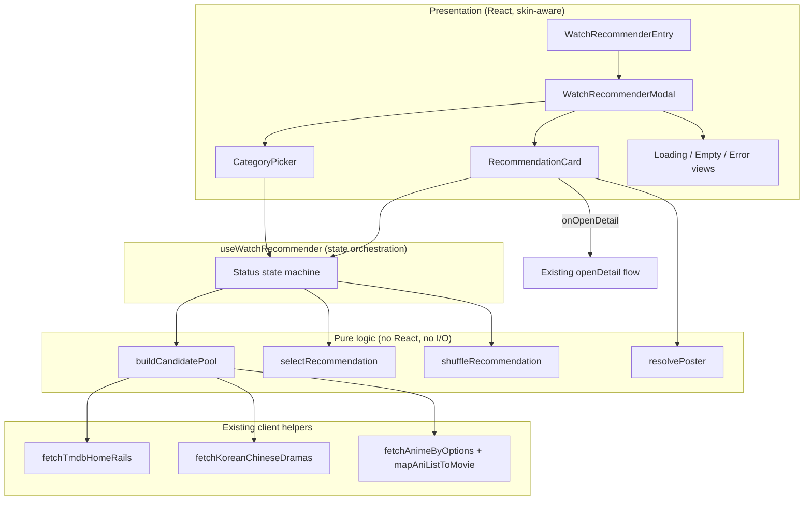
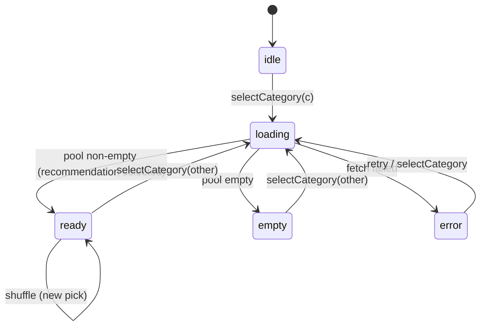

# Design Document

## Overview

The Watch Recommender is a client-side feature layered on top of the existing Lumen streaming app. It helps a viewer who cannot decide what to watch by asking them to pick one of four content categories (Movie, TV Show, Anime, Drama) and then presenting a single randomly-selected title drawn from popular/trending content in that category. The viewer can open the title's detail page, or shuffle to a different suggestion.

The feature is intentionally thin: it does **not** introduce new backend endpoints or new data contracts. It composes the existing client data helpers (`fetchTmdbHomeRails`, `fetchKoreanChineseDramas`, `fetchAnimeByOptions`) and the existing `Movie` type, and it reuses the existing navigation flow (`openDetail`) to hand a `Movie` off to the detail page. Its own responsibilities are:

1. Presenting an entry control and a category picker.
2. Building a **candidate pool** of `Movie` objects for the chosen category from existing sources.
3. Selecting one candidate at random and re-selecting on shuffle (never repeating the current one when alternatives exist).
4. Rendering the recommendation (poster, title, at least one extra detail) with skin-aware, responsive styling.
5. Handling loading, empty, and error states.

The core selection and pool-building logic is pure and deterministic given its inputs (aside from an injectable random source), which makes it well suited to property-based testing. The presentation layer (React components, skin styling, responsive layout) is validated with example/snapshot tests.

### Design Goals

- Reuse existing data helpers and the `Movie` type — no new API surface.
- Keep selection logic pure and testable, isolated from React and from network I/O.
- Respect the two skins (`apple` = "Lumen", `netflix` = "Anime") and mobile-first responsive layout already established in the app.
- Fail gracefully: loading feedback, retry on error, clear empty-state messaging.

### Requirements Coverage Map

| Requirement | Addressed by |
| --- | --- |
| 1. Entry Point | `WatchRecommenderEntry` component + skin styling |
| 2. Category Selection | `CategoryPicker` component + `useWatchRecommender` state machine |
| 3. Candidate Sourcing | `buildCandidatePool`, `selectRecommendation`, category→source mapping |
| 4. Displaying the Recommendation | `RecommendationCard` + `resolvePoster` |
| 5. Acting on the Recommendation | `onOpenDetail` wiring to existing `openDetail` |
| 6. Requesting Another Recommendation | `shuffleRecommendation` + `useWatchRecommender` |
| 7. Loading State | `status` state (`loading`) in the hook |
| 8. Error & Empty-Result Handling | `status` states (`error`, `empty`) + retry action |
| 9. Responsive & Skin-Aware Presentation | CSS driven by `designMode`, mobile-first layout |
| 10. Preference Refinement (optional) | `PreferencePicker` (feature-flagged, out of MVP) |

## Architecture

The feature follows the app's existing separation: **pure data/logic modules** (plain TypeScript, no React), a **state hook** (`useWatchRecommender`) that orchestrates async fetching and state transitions, and **presentational components** that render based on hook state. Skin (`designMode`) is passed down as a prop exactly as the rest of the app does.



### State Machine

The hook models the feature as an explicit status machine. This keeps loading/empty/error handling (Requirements 7 and 8) unambiguous.



- `idle`: no category selected, nothing displayed (Req 2.3).
- `loading`: candidate pool retrieval in progress, loading indicator shown (Req 7.1).
- `ready`: a recommendation is displayed; shuffle stays in `ready` and picks a new title (Req 6).
- `empty`: pool retrieved successfully but contained no titles (Req 8.2).
- `error`: retrieval failed; error message + retry shown (Req 8.1, 8.3).

### Skin Awareness

The app tracks skin via `designMode: 'apple' | 'netflix'`, where `apple` is the "Lumen" skin and `netflix` is the "Anime" skin. The feature receives `designMode` as a prop and applies a matching class name (`watch-recommender ${designMode}-theme`), consistent with how `App.tsx` sets `app-shell ${designMode}-theme`. No new theming system is introduced.

## Components and Interfaces

### File Layout

```
src/
  watch-recommender/
    logic.ts          # pure functions: buildCandidatePool, selectRecommendation, shuffleRecommendation, resolvePoster, categoryToSource
    types.ts          # Category, RecommenderState, RecommenderStatus
    useWatchRecommender.ts  # state hook orchestrating fetch + transitions
    WatchRecommender.tsx    # entry control, modal, category picker, recommendation card, state views
    WatchRecommender.css    # skin-aware, mobile-first styles
    logic.test.ts     # property-based + example tests for pure logic
    WatchRecommender.test.tsx # component/interaction tests
```

The feature is wired into `App.tsx` by rendering `<WatchRecommenderEntry designMode={designMode} onOpenDetail={openDetail} />` and passing the existing `openDetail` callback.

### Pure Logic Module (`logic.ts`)

```ts
import type { Movie } from '../omdb'
import type { TmdbHomeRails } from '../tmdb'

export type Category = 'movie' | 'tv' | 'anime' | 'drama'

// Which existing data source backs each category.
export type CategorySource = 'tmdb-rails' | 'tmdb-drama' | 'anilist'

export function categoryToSource(category: Category): CategorySource

// Raw inputs already fetched by the caller. Building the pool is pure so it can
// be tested without network access.
export interface PoolInputs {
  homeRails?: TmdbHomeRails
  dramaList?: Movie[]
  animeList?: Movie[]
}

// Deduplicates by Movie.id and drops entries without a usable id.
export function buildCandidatePool(
  category: Category,
  inputs: PoolInputs,
): Movie[]

// Injectable RNG so selection is deterministic in tests. Defaults to Math.random.
export type Rng = () => number

// Returns exactly one title, or null when the pool is empty (Req 3.4).
export function selectRecommendation(pool: Movie[], rng?: Rng): Movie | null

// Returns a title different from `current` whenever the pool has >= 2 titles
// (Req 6.3). With a single title, returns that title. With an empty pool, null.
export function shuffleRecommendation(
  pool: Movie[],
  current: Movie | null,
  rng?: Rng,
): Movie | null

// Returns the poster when present/non-empty, otherwise a placeholder (Req 4.4).
export const POSTER_PLACEHOLDER: string
export function resolvePoster(movie: Movie): string
```

Notes:
- `buildCandidatePool` for `movie` draws from `homeRails.movieCollection.top`, `homeRails.trendingNow` (movie entries), and `homeRails.featuredMovies`; for `tv` from `homeRails.tvShowCollection.top` and `homeRails.featuredTvShows`; for `drama` from `dramaList`; for `anime` from `animeList` (already mapped to `Movie` via `mapAniListToMovieStandalone`). All paths return `Movie[]`, satisfying Req 3.3.
- Dedup uses `Movie.id` to avoid the same title appearing twice across rails, which keeps "shuffle produces a different title" meaningful.

### State Hook (`useWatchRecommender.ts`)

```ts
export type RecommenderStatus = 'idle' | 'loading' | 'ready' | 'empty' | 'error'

export interface RecommenderState {
  status: RecommenderStatus
  category: Category | null
  pool: Movie[]
  recommendation: Movie | null
  errorMessage: string | null
}

export interface UseWatchRecommender {
  state: RecommenderState
  selectCategory: (category: Category) => void  // triggers fetch + selection
  shuffle: () => void                            // re-selects from current pool
  retry: () => void                              // re-fetches current category
  reset: () => void                              // back to idle (closes picker)
}

export function useWatchRecommender(): UseWatchRecommender
```

Responsibilities:
- On `selectCategory`, transition to `loading`, call the appropriate data helper(s) for that category, build the pool, then transition to `ready`/`empty`/`error` (Req 2.2, 3, 7, 8).
- `shuffle` calls `shuffleRecommendation(pool, recommendation)` without re-fetching and keeps the same category (Req 6.2, 6.4).
- `retry` re-runs the fetch for the retained category (Req 8.3).
- Guards against stale async responses (a newer category selection supersedes an in-flight one), mirroring the `selectedMovieIdRef` guard already used in `App.tsx`.

### Fetch Adapter

Inside the hook, a small adapter maps a `Category` to the concrete existing helper calls and normalizes the result into `PoolInputs`:

| Category | Source call(s) | Notes |
| --- | --- | --- |
| `movie` | `fetchTmdbHomeRails()` | Use movie rails/collection (Req 3.1) |
| `tv` | `fetchTmdbHomeRails()` | Use TV rails/collection (Req 3.1) |
| `drama` | `fetchKoreanChineseDramas()` | `.list` provides `Movie[]` (Req 3.1) |
| `anime` | `fetchAnimeByOptions({ sort: ['TRENDING_DESC','POPULARITY_DESC'], perPage: 25 })` then `mapAniListToMovieStandalone` | Produces `Movie[]` (Req 3.2, 3.3) |

The existing TMDB helpers swallow network errors and return empty results, so the adapter additionally treats a fully-empty result as `empty`. Where a helper is changed/wrapped to surface failures, a thrown/rejected fetch maps to `error` (Req 8.1). To distinguish "load failed" from "loaded but empty", the adapter wraps the raw `fetch` for anime (which does throw) and treats the TMDB helpers' empty return as `empty` only when the network call itself succeeded.

### Presentational Components (`WatchRecommender.tsx`)

- `WatchRecommenderEntry({ designMode, onOpenDetail })`: renders the Entry_Control ("I don't know what to watch") and opens the modal (Req 1).
- `WatchRecommenderModal`: hosts the picker, recommendation card, and state views; owns the hook.
- `CategoryPicker({ onSelect, selected, designMode })`: exactly four options — Movie, TV Show, Anime, Drama (Req 2.1).
- `RecommendationCard({ movie, category, designMode, onOpenDetail, onShuffle })`: poster (via `resolvePoster`), title, and at least one of year/genres/rating; a category label; open-details and shuffle controls (Req 4, 5, 6).
- `LoadingView`, `EmptyView`, `ErrorView({ onRetry })`: state feedback (Req 7, 8).

All accept `designMode` and apply skin-aware classes; layout is mobile-first with a desktop breakpoint (Req 9).

### Integration Point

```tsx
// In App.tsx, alongside other home controls:
<WatchRecommenderEntry
  designMode={designMode}
  onOpenDetail={openDetail}  // existing navigation; passes the Movie object (Req 5.3)
/>
```

## Data Models

### Category

```ts
type Category = 'movie' | 'tv' | 'anime' | 'drama'
```

Fixed, closed set of four (Req 2.1). Display labels: Movie, TV Show, Anime, Drama.

### Movie (existing, reused unchanged)

The feature uses the app's shared `Movie` type from `src/omdb.ts`. Relevant fields for display and selection:

```ts
type Movie = {
  id: string          // dedup + identity key
  title: string       // Req 4.2
  poster: string      // Req 4.1 / 4.4 (may be empty -> placeholder)
  year: string        // Req 4.3
  genres: string[]    // Req 4.3
  rating: string      // Req 4.3
  synopsis: string
  tmdbId?: number
  tmdbType?: 'movie' | 'tv'
  anilistId?: number
  isAnime?: boolean
  // ...remaining fields carried through to Detail_Page unchanged (Req 5.3)
}
```

No fields are added or modified; the whole object is passed to `openDetail` so playback uses the existing flow.

### RecommenderState

```ts
interface RecommenderState {
  status: 'idle' | 'loading' | 'ready' | 'empty' | 'error'
  category: Category | null
  pool: Movie[]
  recommendation: Movie | null
  errorMessage: string | null
}
```

Invariants (enforced by the reducer):
- `status === 'idle'` ⟺ `category === null` and `recommendation === null` (Req 2.3).
- `status === 'ready'` ⟹ `recommendation !== null` and `pool.length >= 1`.
- `status === 'empty'` ⟹ `pool.length === 0`.
- `shuffle` and `retry` never change `category` (Req 6.4).

## Correctness Properties

*A property is a characteristic or behavior that should hold true across all valid executions of a system — essentially, a formal statement about what the system should do. Properties serve as the bridge between human-readable specifications and machine-verifiable correctness guarantees.*

The pure logic module (`logic.ts`) and the reducer inside `useWatchRecommender.ts` are deterministic given their inputs (with an injectable RNG), which makes them well suited to property-based testing. The properties below are derived from the acceptance criteria that vary meaningfully with input. UI rendering, skin styling, responsive layout, loading/empty/error views, and navigation wiring are validated with example and snapshot tests instead (see Testing Strategy), because they do not vary meaningfully across generated inputs.

### Property 1: Candidate pool sourcing is category-correct

*For any* `PoolInputs` and any `Category`, every title in the result of `buildCandidatePool(category, inputs)` originates from the data source mapped to that category by `categoryToSource` (Movie/TV from `homeRails`, Drama from `dramaList`, Anime from `animeList`), and no title from an unrelated source appears.

**Validates: Requirements 3.1, 3.2**

### Property 2: Candidate pool contains only valid, unique Movie objects

*For any* `PoolInputs` and any `Category`, every element of `buildCandidatePool(category, inputs)` is a valid `Movie` object with a non-empty `id`, and no two elements share the same `id` (deduplication holds).

**Validates: Requirements 3.3**

### Property 3: Selection returns exactly one pool member

*For any* candidate pool and any RNG value in `[0, 1)`, `selectRecommendation(pool, rng)` returns `null` when the pool is empty and otherwise returns exactly one title that is a member of the pool, computed deterministically as `pool[floor(rng * pool.length)]`. As the RNG value sweeps `[0, 1)`, every index of a pool with two or more titles is reachable.

**Validates: Requirements 3.4, 3.5**

### Property 4: Shuffle stays in the pool and avoids repetition when possible

*For any* candidate pool, any `current` title, and any RNG value, `shuffleRecommendation(pool, current, rng)` returns `null` for an empty pool, the sole title for a single-title pool, and — for any pool containing two or more distinct titles where `current` is a member — a title that is a member of the pool and different from `current`.

**Validates: Requirements 6.2, 6.3**

### Property 5: Poster resolution always yields a usable image

*For any* `Movie`, `resolvePoster(movie)` returns a non-empty string; it returns `POSTER_PLACEHOLDER` exactly when the movie's `poster` is missing or empty, and returns the movie's own `poster` otherwise.

**Validates: Requirements 4.1, 4.4**

### Property 6: Reducer state invariants hold across all actions

*For any* reducer state reachable by applying any sequence of actions (`selectCategory`, `shuffle`, `retry`, `reset`), the state invariants hold: `status === 'idle'` if and only if `category === null` and `recommendation === null`; `status === 'ready'` implies `recommendation !== null` and `pool.length >= 1`; `status === 'empty'` implies `pool.length === 0`; and applying `shuffle` or `retry` never changes `category`.

**Validates: Requirements 2.3, 6.4**

## Error Handling

Error and empty-result handling is centered on the `useWatchRecommender` status machine, which distinguishes three non-happy outcomes so the UI can respond precisely.

### Fetch failure (`error` state)

- The fetch adapter wraps each category's data call. For Anime, `fetchAnimeByOptions` rejects on network failure; the adapter catches the rejection and transitions the hook to `error` with a human-readable `errorMessage`.
- The existing TMDB helpers (`fetchTmdbHomeRails`, `fetchKoreanChineseDramas`) currently swallow network errors and return empty results. To satisfy Requirement 8.1 (distinguishing failure from empty), the adapter wraps the underlying network call so a genuine transport failure surfaces as a rejection and maps to `error`, while a successful call that yields no titles maps to `empty` (see below).
- The `ErrorView` renders the message and a retry control (Req 8.1). Activating retry calls `retry()`, which re-runs the fetch for the retained `category` (Req 8.3), returning to `loading`.

### Empty candidate pool (`empty` state)

- When retrieval succeeds but `buildCandidatePool` returns an empty array, the hook transitions to `empty` and `EmptyView` shows a "no recommendation available for that category" message (Req 8.2).
- From `empty`, selecting a different category restarts the flow (`loading`).

### Stale async responses

- Each `selectCategory`/`retry` records the in-flight request; when a response arrives, the hook ignores it if a newer category selection has superseded it. This mirrors the `selectedMovieIdRef` guard in `App.tsx` and prevents a slow earlier fetch from overwriting a newer recommendation.

### Missing or malformed title data

- Titles lacking a usable `id` are dropped during `buildCandidatePool`, so they cannot become a recommendation (supports Property 2).
- Missing/empty poster URLs are handled by `resolvePoster`, which substitutes `POSTER_PLACEHOLDER` (Req 4.4) so the card always renders a usable image.

### Defensive selection

- `selectRecommendation` and `shuffleRecommendation` return `null` for an empty pool rather than throwing; callers treat `null` as the `empty` outcome. This keeps the pure logic total (never throws) and the UI resilient.

## Testing Strategy

The feature is tested with a dual approach: property-based tests for the pure logic and reducer (where behavior varies meaningfully across inputs), and example/component tests for UI rendering, interactions, skin styling, and state-driven views.

### Property-Based Tests (`logic.test.ts`)

- A property-based testing library for TypeScript (**fast-check**, run under Vitest) is used. Property tests are not implemented from scratch.
- Each property test runs a **minimum of 100 iterations**.
- Each test is tagged with a comment referencing its design property, using the format:
  `// Feature: watch-recommender, Property {number}: {property_text}`
- The six correctness properties map one-to-one to six property-based tests:
  - Property 1 → generate `PoolInputs` and a category; assert sourcing correctness.
  - Property 2 → generate inputs; assert every pool entry is a valid `Movie` with a unique, non-empty `id`.
  - Property 3 → generate pools and RNG values; assert membership, deterministic index mapping, `null`-on-empty, and index reachability across the RNG range.
  - Property 4 → generate pools (empty, single, and multi-title with a member `current`) and RNG values; assert membership and difference-from-current when alternatives exist.
  - Property 5 → generate `Movie` objects with empty and non-empty posters; assert placeholder logic.
  - Property 6 → generate action sequences; apply the reducer; assert all state invariants and category retention hold.
- Custom fast-check arbitraries produce `Movie` objects (varying `id`, `poster`, `year`, `genres`, `rating`), `PoolInputs` (varying rail/collection contents including duplicates across rails), and reducer action sequences. Edge cases (empty pools, single-title pools, empty/missing posters, non-ASCII titles, duplicate ids) are covered by the generators.

### Example / Component Tests (`WatchRecommender.test.tsx`)

Using React Testing Library under Vitest, these cover the criteria that do not vary meaningfully across generated inputs:

- Entry control renders with the expected label and opens the picker (Req 1.1, 1.2).
- Category picker renders exactly the four options: Movie, TV Show, Anime, Drama (Req 2.1).
- Selecting a category with a non-empty mocked pool yields a displayed recommendation (Req 2.2).
- Recommendation card shows poster (via `resolvePoster`), title, at least one of year/genres/rating, and the category label (Req 4.1, 4.2, 4.3, 4.5).
- Open-details control calls `onOpenDetail` with the exact recommended `Movie` object (Req 5.1, 5.2, 5.3).
- Shuffle control is present and triggers re-selection without re-fetching (Req 6.1).
- Loading indicator appears during retrieval and is removed on completion (Req 7.1, 7.2).
- Error view shows a message and retry control on fetch failure; retry re-fetches the same category (Req 8.1, 8.3).
- Empty view shows the "no recommendation available" message for an empty pool (Req 8.2).

### Skin and Responsive Tests (snapshot / example)

- Render the entry control, picker, and card in each skin (`apple` = Lumen, `netflix` = Anime) and assert the correct skin class is applied (Req 1.3, 1.4, 9.3, 9.4).
- Snapshot the layout at mobile and desktop breakpoints to confirm mobile-first rendering and the desktop adaptation (Req 9.1, 9.2).

### Integration Test

- One integration-style test wires `useWatchRecommender` with mocked data helpers to exercise the full `idle → loading → ready → shuffle` and `loading → error → retry` flows, confirming the adapter distinguishes failure from empty results.

### Out of Scope

- Requirement 10 (Preference Refinement) is feature-flagged and out of the MVP; when implemented, it adds a property that a preference-restricted pool contains only titles matching the selected preference, plus example tests for the preference picker and its empty-result message.
