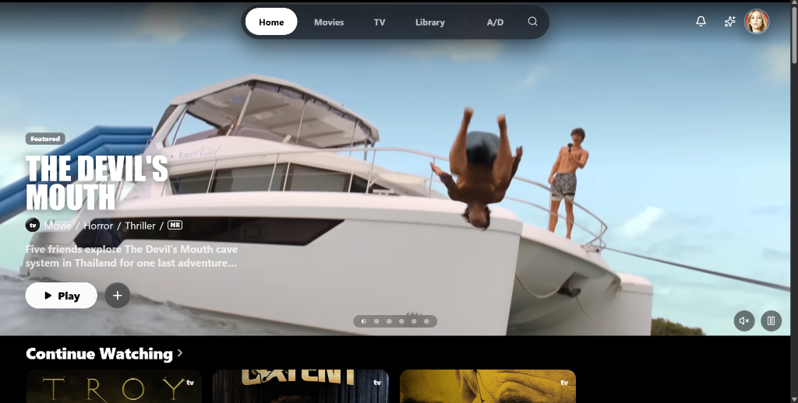
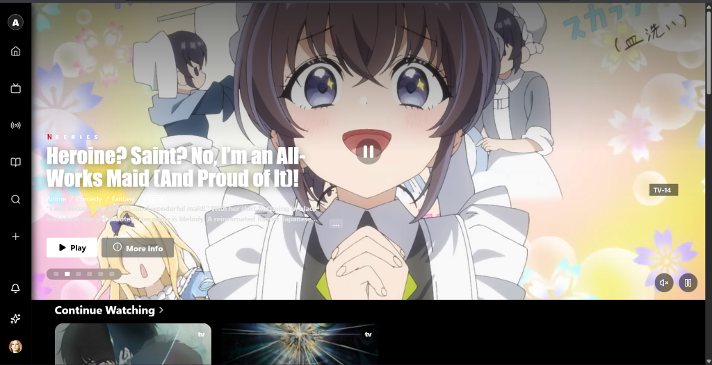

# 🍿 Lumen — Premium Media & Streaming Platform

**Lumen** is a next-generation, high-performance web and mobile streaming platform inspired by Apple TV. Built with a sleek glassmorphic interface, dynamic animations, and zero-ad minimalist design, Lumen brings together Movies, TV Shows, Anime, K-Dramas, and Live TV into a unified streaming ecosystem.

---

## 🖼️ Interface Preview

### Home & Movie Showcase

### Anime & Series Hub

---

## ✨ Key Features & Capabilities

### 🎬 Movies & TV Series
- **Extensive Library**: Stream thousands of Hollywood blockbusters, trending series, and timeless classics in HD.
- **Multiple High-Speed Streaming Servers**: Seamlessly switch between server nodes (Vidking, Rivestream, VIP Server, and Old Server) with built-in auto-fallback for 100% playback reliability.
- **Episode & Season Selector**: Browse complete season guides, episode summaries, runtime details, and release dates.

### 🎌 Anime & Asian Dramas
- **AniList Native Integration**: Subbed & Dubbed anime streams powered by AniList metadata (MegaPlay & VidNest servers).
- **K-Drama & C-Drama Hubs**: Dedicated collections for Korean and Chinese dramas with curated rails and full episode navigation.

### 📺 Live TV & Sports Channels
- Real-time streaming of live television channels, news broadcasts, and sports channels integrated directly into the player.

### 👥 Watch Party Mode
- **Synchronized Viewing**: Create virtual rooms to watch movies or series synchronously with friends.
- **Live Room Controls**: Real-time host controls for play, pause, and timestamp sync.

### 🤖 AI-Powered Watch Recommender
- **Smart Discovery**: Personalized recommendation engine that matches titles based on your mood, preferred genre, duration, and viewing history.

### 🔒 Profiles & Privacy Control
- **Multi-Profile Support**: Custom profiles for family members with individual viewing histories and saved libraries.
- **PIN-Protected Lord Profile**: Secure adult animation and private collections guarded by customizable security PINs.
- **Smart History Management**: Automatic isolation between public continue-watching history and private profiles.

### 📱 Cross-Device Accessibility
- **Responsive Web & Native Mobile App**: Accessible on desktop browsers, tablets, iOS, and Android devices (via Expo / EAS native APK).

---

## 🎨 User Experience Highlights

- **Cinematic Apple TV Aesthetic**: Elegant dark mode with smooth backdrop blur, fluid transitions, and poster art.
- **Instant Search**: Lightning-fast search across movies, TV series, anime titles, cast, and directors.
- **Personal Watchlist**: One-click bookmarking to save titles to your personal Library with progress tracking.
- **Customizable Player Controls**: Adjust stream quality, servers, audio language (Sub/Dub), auto-play next episode, and full-screen modes.

---

  <i>Stream anytime, anywhere with <b>Lumen</b>.</i>

